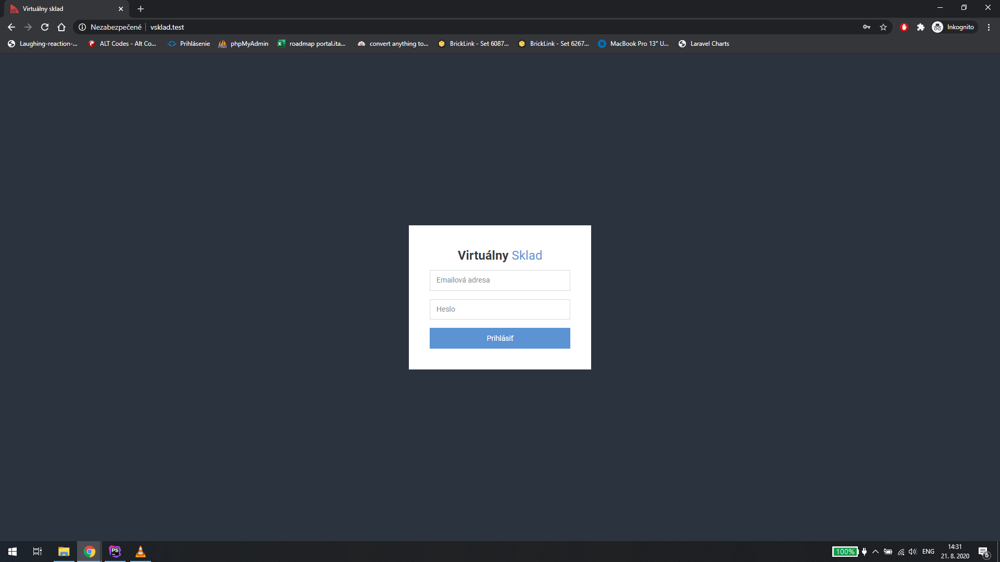
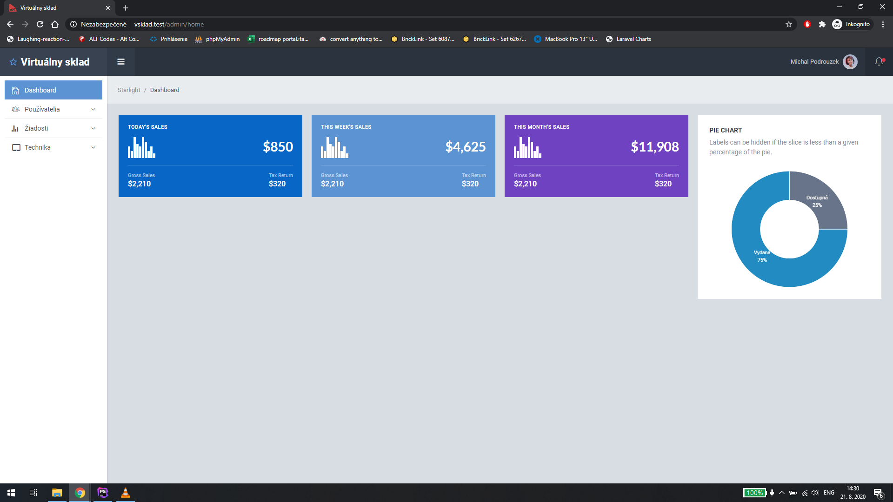
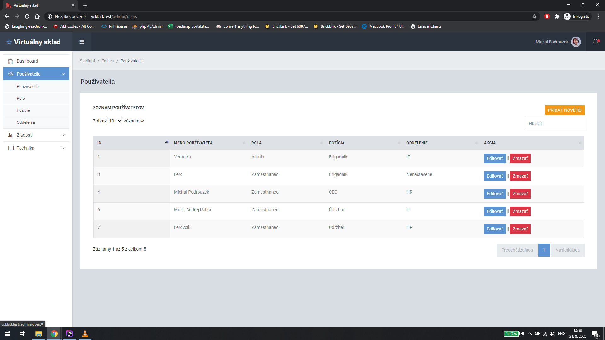
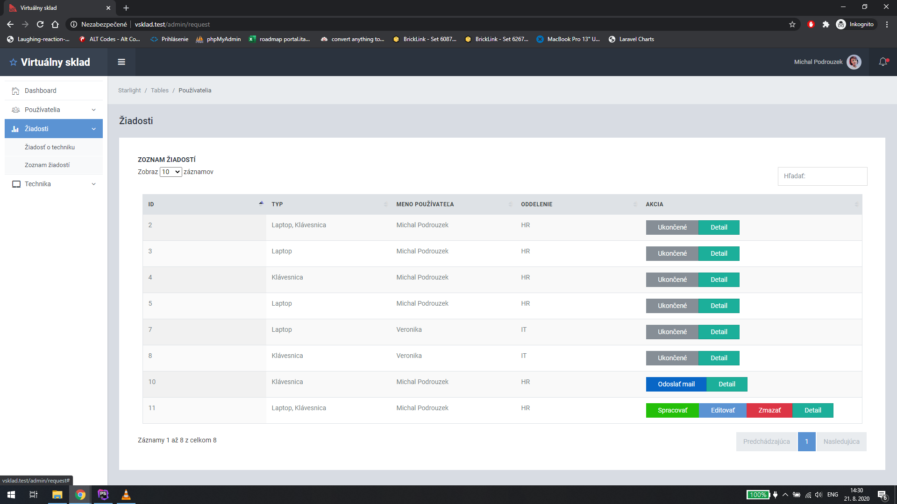
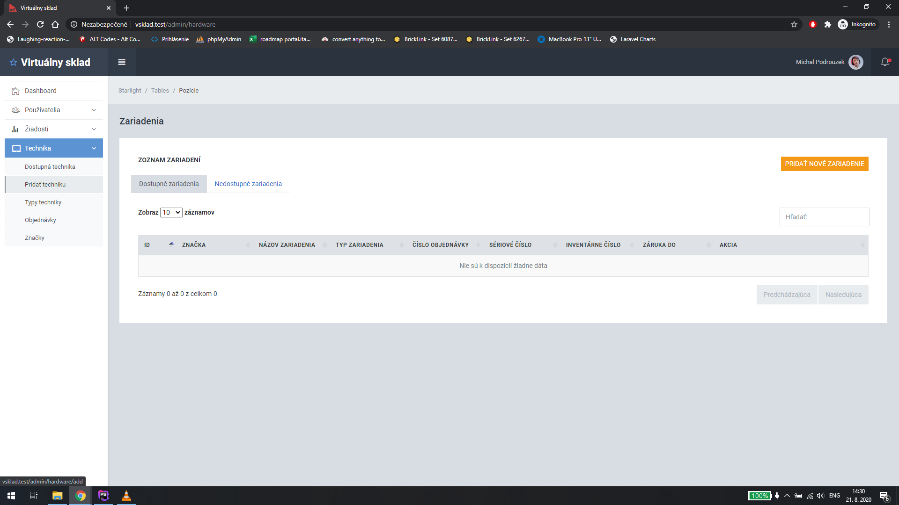
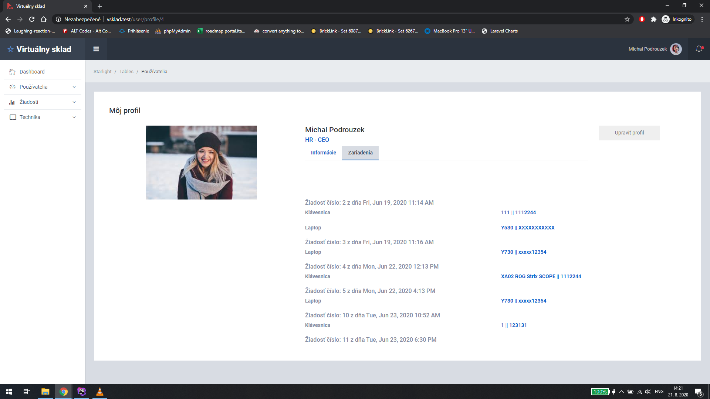

# VSklad

Web application for managing hardware in company storage, users and their roles, requests, orders etc. 

This application is in an early stage of development

## Installation

Clone this repository and run prepared migrations and seeds.

##Usage

User can log in, in default right now is an administrator, so you can do anything. The application is split into 3 main categories: 
- Používatelia where you can manage users, create new ones, manage their roles, positions in the company, departments
- Žiadosti where you can create a new request or process pending requests. 
- Technika where you can check available hardware, add a new one, create/update/delete types, orders and brands
## Screenshots

